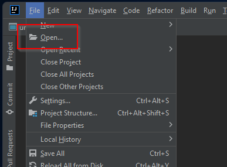
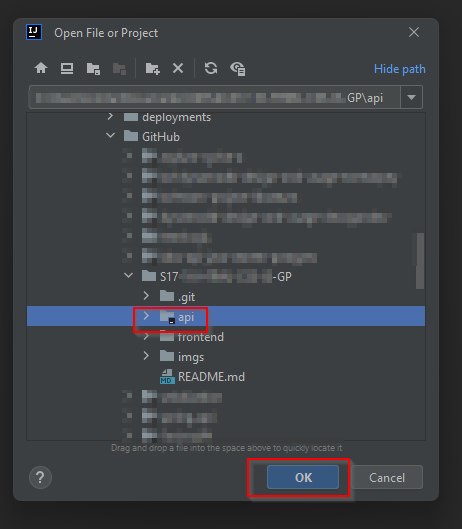
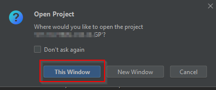
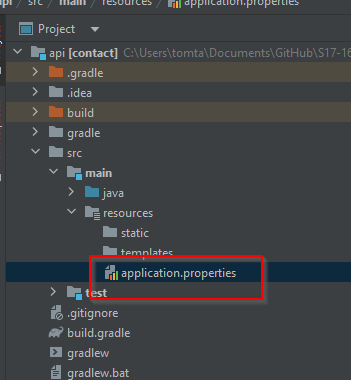
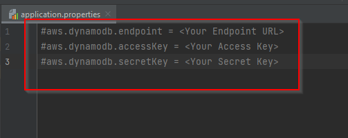
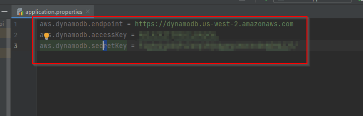
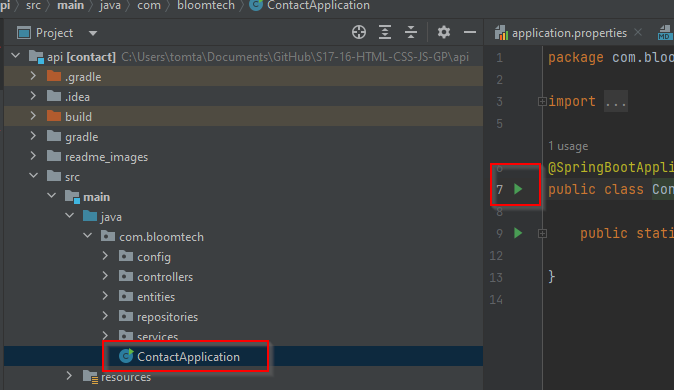
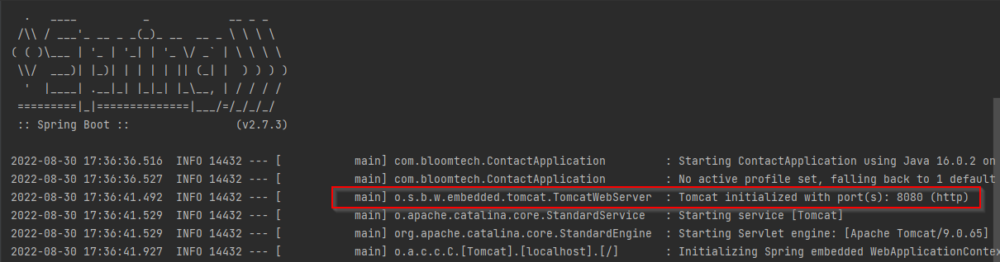
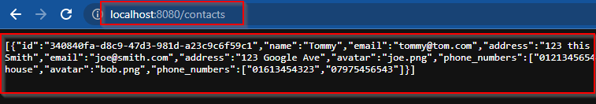

# Backend Readme

## Phase 0
Welcome to the Backend of the `HTML CSS JS GP`. 

At this point you should open the project up in intellij IDE, and follow the instructions below to get your `api` up and running.

- Open the `/api` folder of this repository inside intellij.

- Open the `application.properties` file and edit the variables, filling in your `awsaccesskey` and your `awesecretkey` along with the dynamodb backend url `https://dynamodb.us-west-2.amazonaws.com`, and save the file.

- Open the `ContactApplication` file. Click on the green run button to run the backend API. 

- Once you have done this you should see the SpringBoot api startup information in the bottom right pane of your IDE.

- Open your browser and browse to the address `http://localhost:8080/contacts/`. You should be presented with a list of `JSON` objects from your backend if you have followed the steps correctly.

**Phase 0 is complete when you have successfully opened the api project inside intellij, set your aws credentials up correctly, and have been able to open your webbrowser to the specified address showing the `JSON` list.** 
